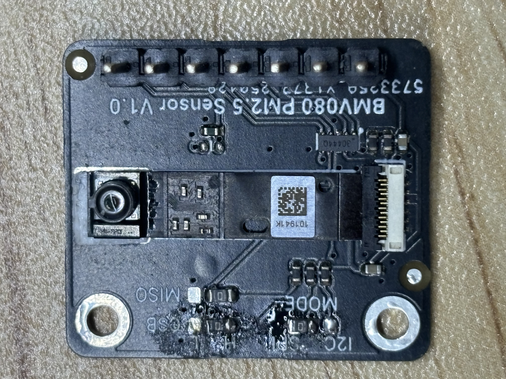

# DFRobot_BMV080
DFRobot_BMV080 is a arduino library designed to drive the new Bosch air quality measurement chip BMV080.                 BMV080 is currently the smallest PM2.5 chip in the world and it uses laser for measurement.                              This library provides two communication methods: IIC and SPI, as well as some basic routines.Currently, it only supports the ESP32 platform. 

## Functionality description
This sensor can measure PM1/PM2.5/PM10 air indicators and can be used as an IIC and SPI slave device. This library can obtain these sensor data through just a few simple functions and it provides IIC and SPI interfaces.

> [!NOTE]
> Since Bosch currently only provides the pre-compiled library of BMV080, it can only support the platforms that are supported by the Bosch library. The SDK used for this update is from Bosch. You can download and update it from their official website. [Click here to jump to the next page](https://www.bosch-sensortec.com/products/environmental-sensors/particulate-matter-sensor/bmv080/#documents). 
> This library has reserved the SDK of version Bosch bmv080-sdk-v11-1-0. You can directly use it or replace it with the latest SDK of your own choice.The replace method will be visible to you later.

## BMV080 Sodtware
You can refer to the wiki for detailed usage instructions. 

### BMV080 WIKI
* [点击此处查看中文wiki](https://github.com/lbx-8023/DFRobot_BMV080/wiki/%E4%B8%AD%E6%96%87-WIKI) 
* [Click here to view the English WIKI](https://github.com/lbx-8023/DFRobot_BMV080/wiki/English-WIKI)

## DFRobot BMV080 Sensor
This BMV080 PM2.5 sensor module is designed to be compact, highly accurate, and has a wide measurement range. Its core is based on the latest BMV080 sensor element developed by Bosch - the world's smallest PM air quality sensor. Its size is over 450 times smaller than similar products on the market. Although the size has been revolutionarily reduced, its performance remains undiminished. It can not only accurately measure the mass concentration of PM2.5 particles in the air, but also support the detection of PM1 and PM10. 

Traditional PM2.5 sensors usually rely on fans or ducts to introduce freely floating particles into the detection area, thus being larger in size and accompanied by the noise from the fans and dust accumulation problems, which increase maintenance costs and the risk of failure. However, this sensor adopts a measurement principle similar to a camera, using laser optical technology, to calculate the mass concentration based on the counting and relative speed of particles in the free space. It ingeniously uses the natural airflow around to drive the particles into the detection area for direct measurement, without the need for fans or forced air flow systems, thus eliminating maintenance troubles and avoiding dust accumulation caused by fans, significantly improving the reliability of the equipment.  

## Change the SDK
If you want to upgrade the Bosch BMV080 SDK, you can follow the steps below. 

### Install the SDK
You can download the SDK from Bosch official website. [Click here to jump to the next page](https://www.bosch-sensortec.com/products/environmental-sensors/particulate-matter-sensor/bmv080/#documents).

### Replace the SDK
You need to replace the files in the DFRobot_BMV080 library with the files from the downloaded SDK. This is extremely important and cannot be wrong!!! 

#### DFRobot_BMV080 library install path
| OS | Directory|
|---|---|
|Windows | $HOME\Documents\Arduino\libraries\DFRobot_BMV080|
|Linux| $HOME/Arduino/libraries/DFRobot_BMV080|
|macOS | $HOME/Documents/Arduino/libraries/DFRobot_BMV080|

Extract the downloaded BMV080 SDK, and then perform the replacement according to the following path. 

| Bosch SDK File | DFRobot_BMV080 library |
|---|---|
|api/inc/bmv080.h| src/bmv080.h|
|api/inc/bmv080_defs.h| src/bmv080_defs.h|
  
The following files can be replaced according to your needs. Just select the corresponding chips for replacement, or replace all of them. 
  
| Bosch SDK File | DFRobot_BMV080 library |
|---|---|
|api/lib/xtensa_esp32/xtensa_esp32_elf_gcc/release/lib_bmv080.a | src/esp32/lib_bmv080.a|
|api/lib/xtensa_esp32/xtensa_esp32_elf_gcc/release/lib_postProcessor.a | src/esp32/lib_postProcessor.a|
|api/lib/xtensa_esp32s3/xtensa_esp32s3_elf_gcc/release/lib_postProcessor.a | src/esp32s3/lib_postProcessor.a|
|api/lib/xtensa_esp32s3/xtensa_esp32s3_elf_gcc/release/lib_bmv080.a | src/esp32s3/lib_bmv080.a|
